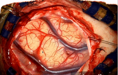

# DejaVu: Intra-operative simulation for surgical gesture rehearsal
Official code and data for realistic intraoperative physics-based simulations for surgery (based on the open-source [SOFA framework](https://www.sofa-framework.org/)) 

<p align="center">
  
  
</p>

## Description

**DejaVu** is a surgical simulation tool for intra-operative gesture rehearsal based on the SOFA framework. It bridges pre-op simulation and intra-op augmented reality by using real-time physical modeling and intra-operative images to deliver visually accurate, interactive organ simulations for grasping, pulling, and cutting.

It has also been successfully used for generating training data for deep learning models and as ground-truth to validate elastic registration or 3D reconstruction methods

[Read the Paper](https://hal.science/hal-01542395/document)  and [Watch the Explainer Video](https://www.youtube.com/watch?v=-UJYWlaTZr0)


## Installation of SOFA

To install the SOFA framework, follow the [official installation guide](https://www.sofa-framework.org/download/) for instructions tailored to your OS.
The scenes are plugin-free and use SOFA core modules, so you should be good to go.


## Citation

If you use DejaVu in any capacity, please cite the following paper:

**Haouchine, N., Stoyanov, D., Roy, F. and Cotin, S.**  
Dejavu: Intra-operative simulation for surgical gesture rehearsal. In MICCAI 2017, Proceedings, Part II 20 (pp. 523-531).

### BibTeX

```bibtex
@inproceedings{haouchine2017dejavu,
  title={Dejavu: Intra-operative simulation for surgical gesture rehearsal},
  author={Haouchine, Nazim and Stoyanov, Danail and Roy, Frederick and Cotin, Stephane},
  booktitle={Medical Image Computing and Computer-Assisted Intervention- MICCAI 2017: 20th International Conference, Quebec City, QC, Canada, September 11-13, 2017, Proceedings, Part II 20},
  pages={523--531},
  year={2017},
  organization={Springer}
}
```
---

## SOFA Scenes
We provide 5 SOFA scenes (XML and Python) for brain, liver, kidney, eye, and uterus surgery. Meshes, textures, and images are provided. 

<p align="left">
  
  
</p>
<p align="left">
  
  
</p>
<p align="left">
  
  
</p>
