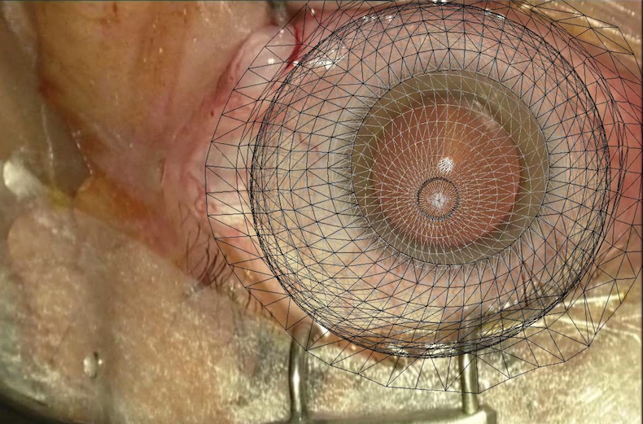

# DejaVu: Intra-operative simulation for surgical gesture rehearsal
Official code and data for realistic intraoperative physics-based simulations for surgery (based on the open-source [SOFA framework](https://www.sofa-framework.org/)) 

<p align="center">
  
  
</p>

## Description

**DejaVu** is a surgical simulation tool for intra-operative gesture rehearsal based on the SOFA framework. It bridges pre-op simulation and intra-op augmented reality by using real-time physical modeling and intra-operative images to deliver visually accurate, interactive organ simulations for grasping, pulling, and cutting.

It has also been successfully used for generating *training datasets* for deep learning models and as *ground-truth* to validate deformable registration, 3D reconstruction, and view synthesis methods, like NeRFs or Gaussian Splats or for *force-feedback* estimation.

For more details, [read the **Paper**](https://hal.science/hal-01542395/document) and [watch the **Explainer Video**](https://www.youtube.com/watch?v=-UJYWlaTZr0)


## Installation of SOFA

To install the SOFA framework, follow the [official installation guide](https://www.sofa-framework.org/download/) for instructions tailored to your OS.
The scenes are plugin-free and use SOFA core modules only, so *binaries* should be enough.


## Citation

If you use DejaVu in any capacity, please cite the following paper:

**Haouchine, N., Stoyanov, D., Roy, F. and Cotin, S.**  
Dejavu: Intra-operative simulation for surgical gesture rehearsal. In MICCAI 2017, Proceedings, Part II 20 (pp. 523-531).

### BibTeX

```bibtex
@inproceedings{haouchine2017dejavu,
  title={Dejavu: Intra-operative simulation for surgical gesture rehearsal},
  author={Haouchine, Nazim and Stoyanov, Danail and Roy, Frederick and Cotin, Stephane},
  booktitle={Medical Image Computing and Computer-Assisted Intervention- MICCAI 2017: 20th International Conference, Quebec City, QC, Canada, September 11-13, 2017, Proceedings, Part II 20},
  pages={523--531},
  year={2017},
  organization={Springer}
}
```
---

## SOFA Scenes
We provide five SOFA scenes (XML and Python) for brain, liver, kidney, eye, and uterus surgeries. Meshes, textures, and surgical images are provided. 

To run the scenes, make sure you're in the SOFA build directory (or a directory where runSofa is executable) and that you have SOFA compiled with Python3 support (SofaPython3 plugin), then simply runSofa:

```bash
./runSofa -g qglviewer ./scenes/liver/liver.py
```

You need "-g qglviewer" option to use the qglviewer camera parameters.
If you do not have SofaPython3, run the **.scn** file instead.

<p align="left">
  
  
</p>
<p align="left">
  
  
</p>
<p align="left">
  
  
</p>
<p align="left">
  
</p>
